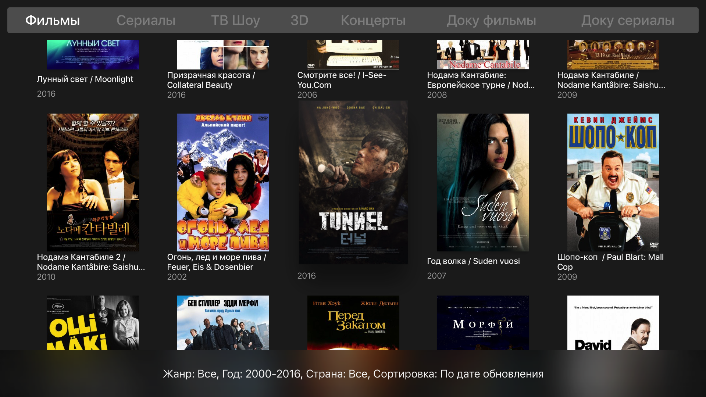

## Kinopub for tvOS (v2)

*В связи с нехваткой времени этот проект теперь open source :). Присоединяйтесь! Работаем в ветке develop*

### Что требуется для запуска: 

* Платный аккаунт на kino.pub
* Xcode 8 / Swift 3
* Приставка AppleTV 4
* Кабель USB-C

### Что работает и что нет

- [x] Активация работает, но при первычном входе не корректно пока отображается главный экран. Он обновляется только на повтором переходе на него.

- [ ] Главный экран. Не доделан. Сюда еще нужны последнии серии и сериалы (которые смотрю и может еще что). Предложения принимаются.

- [x] Подборки

- [x] Просмотр

- [x] Поиск

- [ ] Аккаунт

- [ ] Закладки

- [ ] Фильтры (работают не до конца)

- [ ] Top Shelf (хорошо бы его воплотить в жизнь)

### Контакт

По всем вопросам можно мне отправить мейл: <peter@staticdreams.com> ,
а лучше - зайти в наш чат Slack: <https://appletv4.slack.com>

